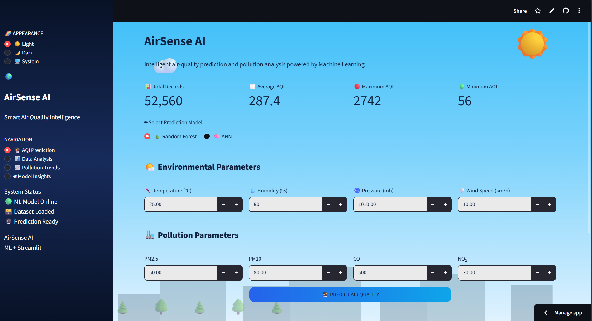
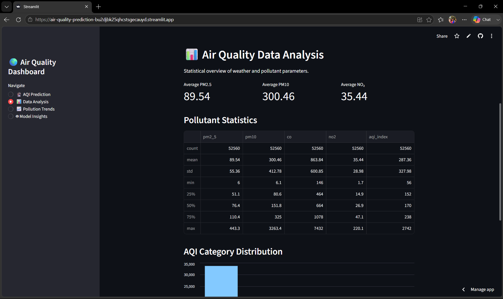

# 🌍 Air Quality Prediction & Pollution Risk Analysis

An end-to-end Machine Learning and Streamlit application that predicts **Air Quality Index (AQI)** and analyzes pollution risk based on air-quality parameters.

The project combines **Machine Learning, Python, Pandas, Scikit-learn, Joblib, and Streamlit** to provide an interactive and easy-to-use interface for air-quality prediction.

## 🚀 Live Demo

🔗 **Streamlit App:**
https://air-quality-prediction-bu2djbk25qhcstsgecauyd.streamlit.app

---

## 📌 Project Overview

Air pollution is an important environmental and public-health concern. This project uses Machine Learning to analyze air-quality data and predict the **Air Quality Index (AQI)**.

The Streamlit application allows users to enter air-quality parameters and receive an AQI prediction along with a corresponding pollution-risk category.

### 🎯 Objectives

* Predict Air Quality Index using Machine Learning.
* Analyze pollution levels from air-quality parameters.
* Categorize AQI into meaningful pollution-risk levels.
* Provide an interactive web interface using Streamlit.
* Make AQI prediction simple and accessible.

---

## ✨ Features

* 🌍 **AQI Prediction**
* 📊 **Pollution Risk Analysis**
* 🧮 Interactive input fields
* 🤖 Machine Learning-based prediction
* 📈 Easy-to-understand AQI categories
* 🖥️ Interactive Streamlit dashboard
* ⚡ Fast prediction
* 📱 Simple and user-friendly interface
* ☁️ Deployed using Streamlit Cloud

---

## 🛠️ Technologies Used

| Technology         | Purpose                             |
| ------------------ | ----------------------------------- |
| 🐍 Python          | Core programming language           |
| 🧠 Scikit-learn    | Machine Learning                    |
| 🐼 Pandas          | Data processing and analysis        |
| 🔢 NumPy           | Numerical operations                |
| 💾 Joblib          | Model saving and loading            |
| 🎨 Streamlit       | Web application and UI              |
| 📁 Git & GitHub    | Version control and project hosting |
| ☁️ Streamlit Cloud | Application deployment              |

---

## 📂 Project Structure

```text
Air_Quality_Project/
│
├── app/
│   └── streamlit_app.py
│
├── model/
│   └── aqi_model.pkl
│
├── screenshots/
│   ├── home.png
│   ├── prediction.png
│   └── result.png
│
├── cleaned_air_quality.csv
├── cleaned_air_quality.zip
├── model.py
├── preprocessing.py
├── requirements.txt
└── README.md
```

---

## 🔄 Project Workflow

```text
Air Quality Dataset
        ↓
Data Preprocessing
        ↓
Feature Selection
        ↓
Model Training
        ↓
Model Evaluation
        ↓
Save Trained Model
        ↓
Streamlit Application
        ↓
User Inputs
        ↓
AQI Prediction
        ↓
Pollution Risk Category
```

---

## 📊 AQI Categories

| AQI Range | Category        |
| --------: | --------------- |
|    0 – 50 | 🟢 Good         |
|  51 – 100 | 🟡 Satisfactory |
| 101 – 200 | 🟠 Moderate     |
| 201 – 300 | 🔴 Poor         |
| 301 – 400 | 🟣 Very Poor    |
| 401 – 500 | 🟤 Severe       |

---

## 🖥️ Application Screenshots

### 🏠 Home / Prediction Interface



### 📊 Prediction Result



### 🌍 Pollution Risk Analysis


---

## 🧠 Machine Learning Model

The project uses a trained Machine Learning model to learn relationships between air-quality parameters and AQI.

The trained model is stored as:

```text
model/aqi_model.pkl
```

The model is loaded in the Streamlit application using **Joblib**.

Because the trained model is large, **Git LFS** is used for model storage.

---

## 📈 Data Processing

The dataset is cleaned and prepared before being used for prediction.

The preprocessing stage includes:

* Handling missing values
* Cleaning the dataset
* Selecting relevant features
* Preparing input data for Machine Learning
* Saving the processed dataset

---

## ⚙️ Installation & Local Setup

### 1. Clone the repository

```bash
git clone https://github.com/alladaindrika3/air-quality-prediction.git
```

### 2. Navigate to the project

```bash
cd air-quality-prediction
```

### 3. Install dependencies

```bash
pip install -r requirements.txt
```

### 4. Run the Streamlit application

```bash
streamlit run app/streamlit_app.py
```

The application will open in your browser.

---

## 🌐 Deployment

The application is deployed using **Streamlit Cloud**.

🔗 **Live Application:**
PASTE_YOUR_STREAMLIT_APP_LINK_HERE

🔗 **GitHub Repository:**
https://github.com/alladaindrika3/air-quality-prediction

---

## 🔮 Future Enhancements

* 📍 Location-based AQI prediction
* 🌦️ Real-time air-quality data integration
* 📊 Interactive historical AQI charts
* 🗺️ AQI visualization using maps
* 🔔 Pollution-level alerts
* 🤖 Improved Machine Learning models
* 📱 Better mobile-responsive interface

---

## 👩‍💻 Author

**Indrika Allada**

with the help of team members

**nikitha**
**gayatri**
**revathi**

💻 Computer Science Engineering Student
🚀 Interested in Machine Learning, AI & Web Development

---

## ⭐ Support

If you find this project useful, consider giving the repository a ⭐ on GitHub!

---

## 🖥️ Application Screenshots

### 🏠 1. Home Page


### 📝 2. Input Interface


### 🔮 3. AQI Prediction


### 📊 4. AQI Result


### 🌍 5. Pollution Category


### 📈 6. Analysis


### 📊 7. Data Visualization


### 🖥️ 8. Final Dashboard


### 📌 Project Links

**GitHub:**
https://github.com/alladaindrika3/air-quality-prediction

## 🚀 Live Demo

🔗 **Streamlit App:**  
https://air-quality-prediction-bu2djbk25qhcstsgecauyd.streamlit.app/
